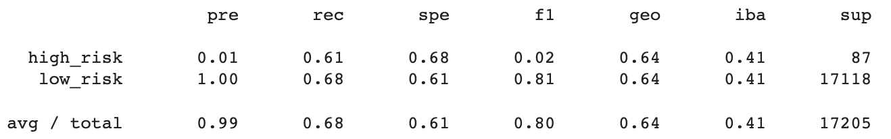
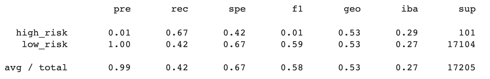
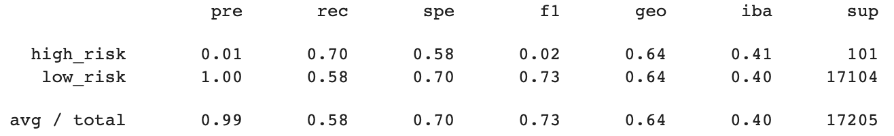
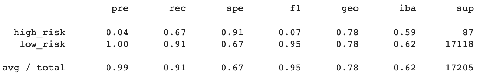
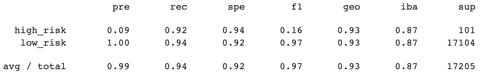

# Credit Risk Analysis
Use sample data from a peer-to-peer lending company, LendingClub, to build a machine learning algorithm to try to predict credit risk.

## Purpose
The purpose of this analysis was to use Python to develop and evaluate the performance of six different machine learning models in order to predict credit risk for a lending company. The six models included: RandomOverSampler model, SMOTE model, SMOTTEN model, ClusterCentroids model, 

## Results

### Reampling Learners
#### Oversampling
1. RandomOverSampler model
This model has a balanced accuracy score of 0.676, with high risk precision of 1% at a recall of 0.61 and f1-score of 0.02.

Due to the small sample size (87), the precision is low (meaning we are only correctly classifying 1% of the class) and recall is high (meaning we are capturing every sample from this class), which means the model is weak in predicting credit risk being high because it is not correctly classifying a majority of the class. 

2. SMOTE model
Consistent with the RandomOverSampler, the balanced accuracy score is 0.676, with high risk precision being 1% at a recall of 0.61 and f1-score of 0.02.

This model is also weak in predicting high credit risk.

#### Undersampling
3. ClusterCentroids model
This model has a balanced accuracy score of 0.519, with high risk precision of 1% at a recall of 0.67 and f1-score of 0.01. 

This model was worse than both RandomOverSampling and SMOTE models in predicition high credit risk.

#### Combination of Over- and Undersampling
4. SMOTEENN model
This model has a balanced accuracy score of 0.64, with high risk precision of 1% at a recall of 0.70 and f1-score of 0.02. 

This model was also weak in predicting high credit risk.

### Ensemble Learners
5. BalancedRandomForestClassifier model
This model has a balanced accuracy score of 0.907, with high risk precision of 4% at a recall of 0.67 and f1-score of 0.07. 

This model, while slightly better than the other four models due to a slightly higher precision, was also weak in predicting high credit risk.

6. EasyEnsembleClassifier model
This model has a balanced accuracy score of 0.931, with high risk precision of 9% at a recall of 0.92 and f1-score of 0.16. 

This model, while even better than the other four models and the BalancedRandomForestClassifier model, due to a higher precision (9%), but it too was also weak in predicting high credit risk.

## Summary
All six models used show weak precision in determining if a credit risk is high for lending. The Ensemble Classifier model brought about the best modeling for high risk credit prediction, however, it still has only 9% precision in accurately predicting a high credit risk case. 
Therefore, I would not recommend the bank use any of these models to predict credit risk, especially based on this data set. If there were far greater high risk cases for the models to use to learn and build predicitions from, I am sure the precision scores would get higher. 
